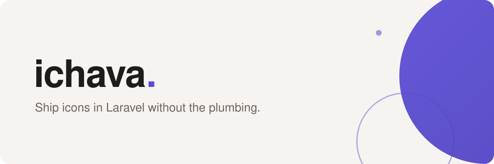

  <a href="https://simtabi.com">
    <picture>
      <source media="(prefers-color-scheme: dark)" srcset="banner-dark.svg">
      
    </picture>
  </a>

<h1 align="center">ichava</h1>

  <strong>Ship icons in Laravel without the plumbing.</strong> 
  A Laravel icon ecosystem by the team at Simtabi. One engine, many packs,
  an optional browser.

  
  
  
  

---

## Why ichava exists

Icons in a Laravel app usually arrive as a folder of SVGs somebody copied in, a
Blade partial that reads them off disk, and no answer to "which pack is this from
and how do we update it". Six months later the pack has moved on and the app has
not.

ichava splits that into parts that can each be replaced. `core` is the engine —
registry, services, seeder, scaffolder, a Blade base component, migrations — with
**no HTTP surface and no JS toolchain**, so it stays headless-friendly. Icon packs
are separate packages that plug into it. `browser` adds the REST API and a Vue SPA
if you want humans searching the set. `maintainer-toolkit` refreshes each pack's
vendored assets from upstream and opens the pull request, so a pack going stale is
a job for CI rather than for you.

## Start here

| Package | What it does |
| --- | --- |
| [`core`](https://github.com/ichava/core) | The engine — registry, services, seeder, scaffolder, Blade base component, migrations. No HTTP surface |
| [`tabler-icons`](https://github.com/ichava/tabler-icons) | Tabler icons, outline and filled, served through the engine |
| [`flag-icons`](https://github.com/ichava/flag-icons) | Country flags in `1x1` and `4x3`, from `lipis/flag-icons` |
| [`emoji-sets`](https://github.com/ichava/emoji-sets) | Twemoji and OpenMoji wiring — engine and CDN config; ships no assets yet |
| [`browser`](https://github.com/ichava/browser) | Optional HTTP layer — REST API, web routes, middleware, Vue/Vite SPA |
| [`motion`](https://github.com/ichava/motion) | `@ichava/motion` — framework-agnostic SVG animation engine, no runtime dependencies |
| [`maintainer-toolkit`](https://github.com/ichava/maintainer-toolkit) | Python, Docker-first. Refreshes vendored assets from upstream by pull request |
| [`documentation`](https://github.com/ichava/documentation) | Long-form docs, grouped by package. Plain markdown, browseable on GitHub |

Per-pack icon counts live in the
[documentation package table](https://github.com/ichava/documentation#packages),
measured rather than quoted. Browse
[all repositories](https://github.com/orgs/ichava/repositories) for the rest.

## Install

Every package is at **`v0.1.0`** and none is published to Packagist yet, so
installation is from the repositories rather than by name. Start with
[`core/installation.md`](https://github.com/ichava/documentation/blob/main/core/installation.md),
then add a pack.

Requires PHP 8.4+ and Laravel 13.

## Need a hand?

- Questions and ideas: open an issue on the package's repository. Answers in the
  open help the next person too.
- Docs are never finished — pull requests are welcome on
  [`documentation`](https://github.com/ichava/documentation).
- Security: [security@simtabi.com](mailto:security@simtabi.com) — never a public issue.
  See the [security policy](https://github.com/ichava/.github/security/policy).

## About Simtabi

ichava is built and maintained by the team at [Simtabi](https://simtabi.com), a
software design agency and design & branding studio operating across New York,
Delaware, and North Carolina, USA. Whenever we build something reusable, we share
it — you'll find it across [@ichava](https://github.com/ichava),
[@laranail](https://github.com/laranail) and
[@simtabi](https://github.com/simtabi).

Released under the [MIT license](https://github.com/ichava/core/blob/main/LICENSE)
unless a repository says otherwise.
